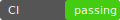

# FinSightAI - Financial Transaction Analyzer

[](https://github.com/PulastTiwari/FinSight/actions)
[](https://github.com/PulastTiwari/FinSight/actions)
[](./LICENSE)

The Financial Transaction Analyzer (FinSight) is an opinionated, open-source MVP for processing and analyzing transactional financial data. It combines deterministic business rules, lightweight ML models, and a modern React dashboard to provide explainable categorization, anomaly detection, and developer-friendly instrumentation for experiments and demos.

## Index

- Quickstart
- API examples
- Where to start (good first tasks)
- Repository contents & structure
- Architecture
- Setup Instructions (cross-platform)
- Troubleshooting
- Data flow and API surface
- Models and training notes
- Example use-cases
- Operational notes
- Runtime configuration
- Running tests (backend)
- Docker
- Deployment troubleshooting & recovery
- Contributing & Where to start
- Security & Code of Conduct
- License

## Architecture

Below is a high-level architecture diagram. If your viewer doesn't render SVGs, the PNG fallback will be used.

<figure>
  <picture>
    <source type="image/svg+xml" srcset="./docs/architecture.svg">
    
  </picture>
  <figcaption>FinSight architecture — Frontend (React) ↔ Backend (Flask + Rules) ↔ Models / Persistence. Click the image to open the full diagram.</figcaption>
</figure>

<!-- diagram file available at ./docs/architecture.svg (removed from index) -->

## Quickstart

Try a fast local demo (no ML dependencies) in two minutes:

```bash
cd backend
python3 -m venv .venv
source .venv/bin/activate
pip install --no-cache-dir -r requirements.light.txt
export SKIP_ML=1
python3 app.py
# then (from repo root or another terminal)
curl -fsS http://127.0.0.1:5002/api/health
```

Expected quick response: a small JSON health object (e.g. {"status":"ok"}).

## API examples

Simple categorize example (POST):

```bash
curl -s -X POST http://127.0.0.1:5002/api/categorize \
  -H 'Content-Type: application/json' \
  -d '{"description":"ACME OFFICE SUPPLIES","amount":123.45,"date":"2025-01-01"}'
```

Sample response:

```json
{
  "category": "procurement",
  "rule_matched": null,
  "confidence": 0.87,
  "anomaly_score": 0.02,
  "is_anomaly": false
}
```

## Where to start (good first tasks)

- Run the quickstart and poke `/api/health` and `/api/analytics`.
- Inspect the rules engine in `backend/app.py` and `backend/rules.json` — small, self-contained logic for beginners.
- Frontend: open `frontend/src/RuleEditor.jsx` and `frontend/src/App.js` for UI wiring and small styling fixes.
- Tests: check `backend/tests/test_rules.py` and add a new test that covers an edge-case rule.

## Repository contents & structure

A concise map of what’s in this repository and where to find key components. The tree below is a compact, fixed-width layout so it renders consistently in Markdown previews:

````
FinSight/
├─ backend/                # Flask API, rules engine, sample data, tests
│  ├─ app.py
│  ├─ rules.json
│  ├─ sample_data.csv
│  ├─ models/               # model training code & artifacts
│  ├─ tests/                # pytest unit tests
│  └─ requirements.light.txt
├─ frontend/               # React SPA (Create React App)
│  ├─ src/
│  ├─ public/
│  └─ package.json
├─ docker/                 # optional Docker contexts and helpers
├─ docker-compose.yml
├─ Dockerfile.backend
├─ Dockerfile.frontend
├─ scripts/                # developer helper scripts
├─ .github/workflows/      # CI definitions
├─ QUICKSTART.md
├─ CONTRIBUTING.md
## Setup Instructions (cross-platform)

These quick setup steps cover macOS / Linux (bash / zsh), Windows (PowerShell), and Windows Subsystem for Linux (WSL). Use `requirements.light.txt` for fast demos and CI; install the full `requirements.txt` only when developing ML code.

1) Clone the repository (all platforms)

```bash
git clone https://github.com/PulastTiwari/FinSight.git
cd FinSight
````

2. Backend — macOS / Linux (bash or zsh)

```bash
# enter backend
cd backend

# create a venv in backend/.venv
python3.11 -m venv .venv || python3 -m venv .venv
source .venv/bin/activate

# upgrade installer tools and install lightweight deps
python -m pip install --upgrade pip setuptools wheel
pip install --no-cache-dir -r requirements.light.txt

# run in fast-demo mode (no heavy ML)
export SKIP_ML=1
export ANOMALY_CONTAMINATION=0.05
python3 app.py

# backend listens on http://127.0.0.1:5002 by default
```

Notes (macOS / Linux):

- For full ML behavior: deactivate venv, install `requirements.txt` instead of `requirements.light.txt`, unset `SKIP_ML`, and run the app (requires more memory and native wheels).
- If you run into binary wheel errors for numpy/scipy, prefer Docker or WSL for reproducible builds.

3. Backend — Windows (PowerShell)

```powershell
# open PowerShell as a normal user (not Admin for venv) and run:
cd backend

# create venv and activate
python -m venv .venv
.\.venv\Scripts\Activate.ps1

# upgrade installer tools and install lightweight deps
python -m pip install --upgrade pip setuptools wheel
pip install --no-cache-dir -r requirements.light.txt

# run in fast-demo mode
$env:SKIP_ML = '1'
$env:ANOMALY_CONTAMINATION = '0.05'
python app.py

# server: http://127.0.0.1:5002
```

Windows notes:

- If `Activate.ps1` is blocked by execution policy, either use `Set-ExecutionPolicy -Scope Process -ExecutionPolicy Bypass` for the session or use the `activate.bat` script in `.venv\Scripts`.
- For heavier ML installs on Windows, WSL or Docker is recommended.

4. Frontend (macOS / Linux / Windows)

```bash
cd frontend
npm ci
# dev server
npm start
# or produce a production build
npm run build
```

Notes:

- On Windows PowerShell, use the same `npm` commands in the `frontend` folder.
- If `npm ci` fails because `node`/`npm` are missing, install Node.js LTS from nodejs.org or use nvm / nvm-windows.

5. Docker (optional, cross-platform)

```bash
# build & run full stack with docker-compose (pass SKIP_ML env if you want demo mode)
SKIP_ML=1 docker-compose up --build

# or on PowerShell
$env:SKIP_ML='1'; docker-compose up --build
```

6. Quick verification & testing

```bash
# health check
curl -fsS http://127.0.0.1:5002/api/health

# run backend tests (inside backend/.venv)
source backend/.venv/bin/activate   # or .\.venv\Scripts\Activate.ps1 on Windows
ANOMALY_CONTAMINATION=0.05 pytest -q
```

Extra tips

- Prefer `SKIP_ML=1` and `requirements.light.txt` for CI and quick developer feedback.
- If you need reproducible ML builds, use Docker with a known base image (see `Dockerfile.backend`).
- See `QUICKSTART.md` for a shorter demo-focused flow.

### Troubleshooting (venv & npm)

Common issues and quick fixes when setting up the backend/frontend locally:

- venv won't activate / "command not found":

  - macOS/Linux: run `python3 -m venv .venv` then `source .venv/bin/activate`.
  - Windows PowerShell: run `.\.venv\Scripts\Activate.ps1` (or use `activate.bat` if execution policy blocks scripts).
  - If activation fails, ensure you're using the right Python executable (python3.11 vs python) and that the `.venv` folder exists.

- pip install fails with binary wheel errors (numpy/scipy):

  - Try upgrading pip + wheel: `python -m pip install --upgrade pip setuptools wheel`.
  - Use the `requirements.light.txt` for demos, or run inside Docker/WSL where compatible wheels are available.

- `npm ci` or `npm install` errors:

  - Ensure Node.js (LTS) and npm are installed and on PATH. Use `node -v` and `npm -v` to verify.
  - If dependency conflicts occur, try `npm ci --legacy-peer-deps` or remove `node_modules` and `package-lock.json` then re-run `npm ci`.
  - On Windows, enable long paths or run in WSL if path-length errors appear.

- Permission / EACCES errors on global installs:

  - Avoid global installs; prefer `npx` or use a node version manager (nvm / nvm-windows) to manage permissions.

- Still stuck? Collect these diagnostics and search/raise an issue:
  - `python --version`, `pip --version`, `node --version`, `npm --version`
  - `pip install` error output and `npm ci` logs
  - OS and shell (macOS zsh / Windows PowerShell / WSL)

See `QUICKSTART.md` for a shorter demo-focused flow.

## Data flow and API surface (contract)

This section summarizes the stable API contract the frontend and integrators should rely on. Keep the surface small and predictable so tests and the UI remain simple.

Content type: JSON (application/json)

Common response envelope (errors):

{
  "error": "short message",
  "details": { ... }   # optional, implementation-defined
}

1) POST /api/categorize
- Purpose: classify a single transaction, apply rules, return ML confidence and anomaly score.
- Request body:

  {
    "description": "string",
    "amount": number,
    "date": "YYYY-MM-DD",
    // optional fields used by rules/models
    "merchant": "string",
    "metadata": { ... }
  }

- Success response (200):

  {
    "category": "string",
    "rule_matched": "<rule_id|null>",
    "confidence": 0.0-1.0,
    "anomaly_score": 0.0-1.0,
    "is_anomaly": true|false
  }

- Errors: 400 for malformed payload, 500 for server errors.

Example request:

```json
{
  "description": "ACME OFFICE SUPPLIES",
  "amount": 123.45,
  "date": "2025-01-01"
}
```

2) GET /api/analytics
- Purpose: return aggregated metrics used by dashboard charts (counts by category, anomaly counts, recent samples).
- Query params: optional `start_date`, `end_date`, `limit` (for sample lists)
- Success response (200): object with `by_category`, `anomalies`, `samples` arrays.

3) Rules management
- GET /api/rules — list rules (used by UI rule editor)
- POST /api/rules — add or update a rule (accepts rule JSON)
- DELETE /api/rules/<id> — remove a rule

Responses for management endpoints follow common status codes (200/201/204 for success, 400/404/409 for errors).

4) Health & metadata
- GET /api/health — lightweight health object {"status":"ok"}
- GET /api/version or /api/metadata — optional, returns service version and model metadata if available

Notes and contract guarantees
- Content-type is always application/json for API endpoints.
- The `rule_matched` field is authoritative when non-null — rules override ML predictions.
- The `confidence` is a best-effort floating number; do not use it as a strict probability in production without calibration.
- No authentication is enforced by default in the MVP; add auth middleware for production deployments.

Pagination and rate-limits
- Management endpoints may paginate large lists; callers should expect `limit`/`offset` or cursor-based paging in future versions.
- No built-in rate limit in the demo; enforce API limits in front of the service in production.

Versioning
- If breaking API changes are introduced, increment the API version (eg. /v2/) and keep the previous path for a reasonable migration window.


## Models and training notes

- Models are trained from `backend/sample_data.csv` in a simple `train()` flow when `SKIP_ML` is not set. The project is intentionally lightweight — for production-quality models you would replace the small RandomForest with a persisted model artifact and a CI/CD model registry.
- IsolationForest `contamination` is read from `ANOMALY_CONTAMINATION` and clamped to a safe default if missing or out-of-range.

## Example use-cases

- Demo / teaching: show how rules and ML interact — e.g., define a rule that forces `category=procurement` for merchant `OFFICE_SUPPLIES_CO` and see how ML predictions and rule precedence behave.
- Fraud spotting: flag unusually large or rare transactions for human review (IsolationForest + rule-based thresholds).
- Data hygiene: auto-categorize refunds/chargebacks and surface inconsistent descriptions for reconciliation.
- Rapid prototyping: swap in a new classifier or tune `ANOMALY_CONTAMINATION` without changing the frontend; rules provide a quick deterministic fallback for business logic.

## Operational notes

- Fast demo mode: set `SKIP_ML=1` to skip heavy ML imports/training and use `requirements.light.txt` for CI and thin environments.
- Reproducible tests: CI sets `ANOMALY_CONTAMINATION=0.05` for deterministic anomaly behavior; mirror this locally when running `pytest` for consistent results.
- Persistence: rules are stored in `backend/rules.json` — treat this as an example store; replace with a database for multi-user deployments.

### Runtime configuration

The backend supports a small set of environment variables to control demo vs. ML mode and anomaly sensitivity.

- SKIP_ML (boolean): if set to `1` the backend skips heavy ML imports and training. Useful for demos and CI.
- ANOMALY_CONTAMINATION (float): controls IsolationForest contamination (expected proportion of outliers). Behavior:
  - Default: `0.2` (20%);
  - Valid range: (0, 0.5). Values outside this range will fall back to the default.

Examples:

Local (fast demo, default contamination):

```bash
export SKIP_ML=1
export ANOMALY_CONTAMINATION=0.2
python3 app.py
```

Local (full ML, tuned contamination):

```bash
unset SKIP_ML
export ANOMALY_CONTAMINATION=0.05
# ensure full requirements installed
pip install -r requirements.txt
python3 app.py
```

Docker-compose: you can set the variable in `docker-compose.yml` under the backend service or pass it at runtime:

```yaml
services:
  backend:
    environment:
      - SKIP_ML=1
      - ANOMALY_CONTAMINATION=0.1
```

Or pass at runtime:

```bash
ANOMALY_CONTAMINATION=0.1 docker-compose up --build
```

For frontend development and build instructions, see `frontend/README.md` (this file is intentionally concise and developer-focused).

---

## Running tests (backend)

Inside `backend/.venv`:

```bash
source .venv/bin/activate
pip install pytest
pytest -q
```

Unit tests currently focus on the rules evaluator (small and fast).

---

## Docker (recommended for reproducible demos)

A Docker-based path isolates local environment differences.

Build backend image (lightweight by default):

```bash
# from repo root
docker build -f Dockerfile.backend -t finsight-backend .
# run with demo mode
docker run -d -e SKIP_ML=1 -p 5002:5002 --name finsight-backend finsight-backend
```

Start full stack with docker-compose:

```bash
docker-compose up --build
```

Notes:

- `Dockerfile.backend` honors a build-arg to use `requirements.light.txt` to speed builds.
- If you need the full ML image, ensure the base image matches your Python ABI and has sufficient memory.

---

## Deployment troubleshooting & recovery

When a deployment fails or the service misbehaves, use these commands and checks to recover or collect diagnostics:

- Check running containers and their logs:

```bash
docker ps -a
docker logs <container-id-or-name> --tail 200
```

- Inspect an image locally (run a shell inside the container):

```bash
docker run --rm -it -e SKIP_ML=1 ghcr.io/<owner>/finsight-backend:latest /bin/sh
```

- Rebuild backend image locally (light/demo):

```bash
docker build -f Dockerfile.backend -t finsight-backend:local --build-arg USE_LIGHT=1 .
```

- Recreate docker-compose stack (fresh state):

```bash
docker-compose down --volumes --remove-orphans
docker-compose up --build
```

- Quick health checks (service should respond at /api/health and /api/analytics):

```bash
curl -fsS http://127.0.0.1:5002/api/health
curl -fsS http://127.0.0.1:5002/api/analytics
```

- Fix Python env issues (recreate venv):

```bash
cd backend
rm -rf .venv
python3.11 -m venv .venv
source .venv/bin/activate
pip install --upgrade pip
pip install -r requirements.light.txt
```

- If ML native wheels fail on host, prefer building/running in Docker where wheels are known-good, or install matching binary wheels for your Python version.

## CI / Release notes

- CI config in `.github/workflows/ci.yml` installs the `requirements.light.txt` and runs backend tests and the frontend build step for PR validation.

  - For reproducible backend tests the CI sets `ANOMALY_CONTAMINATION=0.05`; we recommend mirroring this locally when running `pytest` so test outcomes are consistent across environments.
  - Recommended release flow:

  1.  Create a feature branch with changes
  2.  Push branch and open PR
  3.  Wait for CI to pass (build + tests)
  4.  Merge and create a release or Docker image from CI

  ### Docker publish workflow & smoke tests

  This repository includes a dedicated GitHub Actions workflow that builds and publishes container images and runs a simple post-deploy smoke test. File: `.github/workflows/docker-publish.yml`.

  - What it does:

    - Builds and pushes a lightweight demo backend image (uses `backend/requirements.light.txt`) and a full-ML backend image (uses `backend/requirements.txt`).
    - Builds and pushes a frontend image.
    - Uses Docker Buildx with a local cache to speed repeated builds in CI.
    - After images are built, a `post-deploy-smoke` job brings up the compose stack and runs quick `/api/health` and `/api/analytics` checks.

  - How to use:
    - Trigger automatically on pushes to `main` or manually via the Actions UI (`workflow_dispatch`).
    - The workflow authenticates to `ghcr.io` by default using `${{ secrets.GITHUB_TOKEN }}`; you can change registry/login steps to use Docker Hub or another registry and corresponding secrets.
    - If your organization restricts package publishing, ensure the token used by the workflow has `packages: write` privilege.

  ### License headers helper

  I added a small helper script at `scripts/insert_license_headers.py` that can insert a short MIT license header into source files (safe-ish; it skips files that already contain the header). It's intentionally opt-in — run it locally, review changes, and commit if you want headers applied across the repo.

  Run locally (example):

  ```bash
  python3 scripts/insert_license_headers.py
  # review changes with `git diff` and commit if acceptable
  ```

---

## Production readiness checklist (pre-merge)

- [ ] Backend unit tests passing (`pytest`)
- [ ] Backend API returns healthy analytics with `SKIP_ML=1` or has proper ML environment
- [ ] Frontend production build succeeds (`npm run build`)
- [ ] Remove any `debug=True` from `app.run` in `backend/app.py` (use a WSGI server in prod)
- [ ] CI passes for PR
- [ ] Do not commit `node_modules/` or `build/` to the repository — prefer CI-generated artifacts or Docker images

---

## Learning resources and references

- Scikit-learn feature extraction: https://scikit-learn.org/stable/modules/feature_extraction.html
- IsolationForest docs: https://scikit-learn.org/stable/modules/generated/sklearn.ensemble.IsolationForest.html
- Flask deployment recommendations (production servers): https://flask.palletsprojects.com/en/latest/deploying/
- React production build guidance: https://create-react-app.dev/docs/deployment/

---

## Contributing

See `CONTRIBUTING.md` for coding standards, tests, and branch strategy. Create a PR for significant changes and reference related issues.

---

## License

## Community & Discussions

We host open discussion using GitHub Discussions. If you have questions, ideas, or want to show a demo, please use the Discussions tab on the repository (or open an issue when appropriate).

Quick links:

- Discussions: https://github.com/PulastTiwari/FinSight/discussions
- CONTRIBUTING guide: ./CONTRIBUTING.md
- Community templates and starter posts: ./.github/DISCUSSIONS-STARTERS.md

If you'd like starter pinned topics created (Welcome / Roadmap), say so and a maintainer can pin them in the Discussions UI.


## License

This project is licensed under the MIT License. See the `LICENSE` file in the repository root for the full license text. Include license headers in files and artifacts as required by your distribution.
