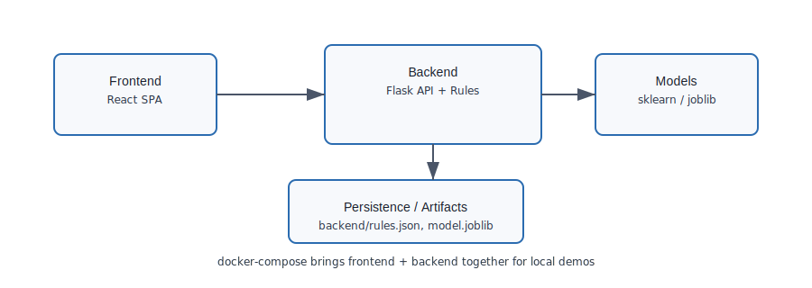

# Financial Transaction Analyzer

[](https://github.com/PulastTiwari/FinSight/actions)
[](https://github.com/PulastTiwari/FinSight/actions)
[](./LICENSE)

The Financial Transaction Analyzer (FinSight) is an opinionated, open-source MVP for processing and analyzing transactional financial data. It combines deterministic business rules, lightweight ML models, and a modern React dashboard to provide explainable categorization, anomaly detection, and developer-friendly instrumentation for experiments and demos.

## Table of contents

- Quickstart
- API examples
- [Architecture](#architecture)
- Setup & Local dev
- Running tests
- Docker & CI
- Troubleshooting
- Contributing & Where to start
- Security & Code of Conduct
- License

## Quickstart

Try a fast local demo (no ML dependencies) in two minutes:

```bash
cd backend
python3 -m venv .venv
source .venv/bin/activate
pip install --no-cache-dir -r requirements.light.txt
export SKIP_ML=1
python3 app.py
# then (from repo root or another terminal)
curl -fsS http://127.0.0.1:5002/api/health
```

Expected quick response: a small JSON health object (e.g. {"status":"ok"}).

## API examples

Simple categorize example (POST):

```bash
curl -s -X POST http://127.0.0.1:5002/api/categorize \
  -H 'Content-Type: application/json' \
  -d '{"description":"ACME OFFICE SUPPLIES","amount":123.45,"date":"2025-01-01"}'
```

Sample response:

```json
{
  "category": "procurement",
  "rule_matched": null,
  "confidence": 0.87,
  "anomaly_score": 0.02,
  "is_anomaly": false
}
```

## Where to start (good first tasks)

- Run the quickstart and poke `/api/health` and `/api/analytics`.
- Inspect the rules engine in `backend/app.py` and `backend/rules.json` — small, self-contained logic for beginners.
- Frontend: open `frontend/src/RuleEditor.jsx` and `frontend/src/App.js` for UI wiring and small styling fixes.
- Tests: check `backend/tests/test_rules.py` and add a new test that covers an edge-case rule.

## Repository contents & structure

A concise map of what’s in this repository and where to find key components:

- backend/ — Flask API, rules engine, sample data, ML training scripts, persisted rules (`rules.json`), tests, and lightweight deps (`requirements.light.txt`).
- frontend/ — React single-page app (Create React App) with the Rule Editor UI, charts, and package.json.
- backend/models/ — model training code and persisted artifacts (TF-IDF, RandomForest, IsolationForest) when present.
- docker/, Dockerfile.backend, docker-compose.yml — container images and compose setup for reproducible demos and full-stack runs.
- QUICKSTART.md, README.md, CONTRIBUTING.md — docs and quickstart instructions.
- Makefile, scripts/ — local developer helper tasks and build shortcuts.
- .github/workflows/ — CI definitions (light job + optional ML job).
- requirements.txt / requirements.light.txt — full vs. fast-demo Python dependency manifests.

### Core components

- Backend: Flask app (`backend/app.py`) exposing REST endpoints for transaction categorization, analytics, rules management, and anomaly scoring. Core libs: pandas, numpy, scikit-learn (optional), and JSON persistence for rules (`backend/rules.json`).
- Frontend: React SPA (Create React App) with a Rule Editor, transaction visualizations, and live API calls to the backend.
- Models: TF-IDF + RandomForest for text-based category prediction and IsolationForest for anomaly detection; optional for demos and skippable via `SKIP_ML`.

## Key capabilities and components

- Deterministic Transaction Rules Engine: express business rules as prioritized conditions (equals/contains/>,<) with actions (categorize, flag, comment). Rules are stored in `backend/rules.json` and editable from the frontend Rule Editor.
- ML-based Categorization (optional): TF-IDF feature extraction over transaction description + numeric features (amount) fed to a RandomForest classifier to infer categories like `income`, `travel`, `utilities`, `procurement`, `refund`.
- Anomaly Detection: IsolationForest flags transactions as anomalous. The expected proportion of outliers is tunable with the environment variable `ANOMALY_CONTAMINATION` (default `0.2`, valid range (0, 0.5)).
- Analytics Endpoints: summary statistics, category distributions, top merchants, and anomaly summaries returned as compact JSON for the frontend charts.
- Developer and CI-first ergonomics: `SKIP_ML=1` enables a fast demo path without heavy ML dependencies; `requirements.light.txt` provides a lightweight install for CI and constrained machines.

## Architecture & Technology Rationale

We chose a minimal, modular architecture to make the project approachable for learners while keeping it realistic for production evolution:

- Flask (Python) backend: microframework with a tiny surface area that's easy to extend, test, and deploy behind a WSGI server. It integrates naturally with pandas/numpy and scikit-learn for model code.
- React frontend (Create React App): fast developer feedback loop, widespread familiarity, and a single-page app model that maps well to the REST API. Ant Design components are used in the front-end for consistent UI patterns and rapid prototyping.
- pandas / numpy: canonical libraries for tabular data manipulation and numeric transforms during feature engineering.
- scikit-learn (optional): lightweight, well-documented algorithms (TF-IDF, RandomForest, IsolationForest) that provide a clear educational path for classification and unsupervised anomaly detection.
- Simple JSON persistence for rules: rules are human-editable and easy to reason about; this keeps the demo self-contained and reduces infrastructure friction for contributors.

## Architecture

[](./docs/architecture.svg)

_Figure 1 — High-level architecture (click to view full-size)._

Design trade-offs:

- Keep the core simple and replaceable: pipelines are intentionally small so contributors can swap in production-grade model artifacts or a DB-backed rules store later.
- Fast demo path: `SKIP_ML` and `requirements.light.txt` were added so the project runs on low-memory CI agents and developer laptops without requiring heavy native wheels.

## Project workflow

This project follows a familiar feature-branch → PR → CI workflow with a few ML-specific steps:

1. Branch & iterate

- Create a feature branch: `git checkout -b feat/<short-description>`
- Make code changes, update or add unit tests under `backend/tests/` or frontend tests under `frontend/`.

2. Local dev & quick checks

- Fast local demo (no ML):

```bash
cd backend
python3 -m venv .venv
source .venv/bin/activate
pip install -r requirements.light.txt
export SKIP_ML=1
python3 app.py
```

- Run unit tests:

```bash
source .venv/bin/activate
ANOMALY_CONTAMINATION=0.05 pytest -q
```

3. Optional ML iteration

- If you are developing models, train locally with full dependencies (unset `SKIP_ML` and install `requirements.txt`) or run `backend/models/train_and_save.py` to produce a persisted model artifact.

4. CI & PR

- Push your branch and open a pull request. CI runs a fast light-job (no heavy ML) and a separate `backend-ml` job that installs full ML deps and runs ML tests.

5. Release

- Use the Dockerfiles and CI to produce reproducible images. The `backend-ml` CI job can be used to create a full-ML image for production if required.

Notes:

- Use `ANOMALY_CONTAMINATION=0.05` in CI and when running tests to keep anomaly-sensitive tests deterministic.
- Rules updates are stored in `backend/rules.json`; for multi-user or production deployments replace this with a transactional DB and migrate rules accordingly.

## Data flow and API surface (contract)

1.  Frontend sends a transaction payload to the backend (`POST /api/categorize`):

- Input shape: {"description": string, "amount": number, "date": "YYYY-MM-DD", ...}
- Output: {"category": string, "rule_matched": <rule_id|null>, "confidence": float, "anomaly_score": float, "is_anomaly": bool}

2.  Analytics request (`GET /api/analytics`) returns aggregates used for charts (counts by category, running totals, anomaly counts) and sample anomalous transactions for drill-down.

3.  Rules CRUD (`GET/POST /api/rules`, `DELETE /api/rules/<id>`) allows programmatic management of deterministic rules.

## Models and training notes

- Models are trained from `backend/sample_data.csv` in a simple `train()` flow when `SKIP_ML` is not set. The project is intentionally lightweight — for production-quality models you would replace the small RandomForest with a persisted model artifact and a CI/CD model registry.
- IsolationForest `contamination` is read from `ANOMALY_CONTAMINATION` and clamped to a safe default if missing or out-of-range.

## Example use-cases

- Demo / teaching: show how rules and ML interact — e.g., define a rule that forces `category=procurement` for merchant `OFFICE_SUPPLIES_CO` and see how ML predictions and rule precedence behave.
- Fraud spotting: flag unusually large or rare transactions for human review (IsolationForest + rule-based thresholds).
- Data hygiene: auto-categorize refunds/chargebacks and surface inconsistent descriptions for reconciliation.
- Rapid prototyping: swap in a new classifier or tune `ANOMALY_CONTAMINATION` without changing the frontend; rules provide a quick deterministic fallback for business logic.

## Operational notes

- Fast demo mode: set `SKIP_ML=1` to skip heavy ML imports/training and use `requirements.light.txt` for CI and thin environments.
- Reproducible tests: CI sets `ANOMALY_CONTAMINATION=0.05` for deterministic anomaly behavior; mirror this locally when running `pytest` for consistent results.
- Persistence: rules are stored in `backend/rules.json` — treat this as an example store; replace with a database for multi-user deployments.

The next sections cover setup, quickstart, and development workflows.

## Setup Instructions

### 1. Clone the Repository

```bash
git clone https://github.com/PulastTiwari/FinSight.git
cd FinSight
```

Quickstart and fast demo guidance are in `QUICKSTART.md` — use SKIP_ML=1 for demos and CI to avoid heavy ML training on low-memory machines.

### 2. Backend Setup (Python/Flask)

1. Navigate to the backend directory:
   ```bash
   cd backend
   ```
2. Create a Python virtual environment:

   ```bash
   python3 -m venv ../.venv

   # FinSight — Financial Insights Platform (Technical README)

   FinSight is an open-source, full-stack platform for transaction analytics, categorization, and anomaly detection. It pairs a lightweight Flask API with a React-based dashboard and includes a beginner-friendly Transaction Rules Engine for deterministic business rules alongside optional ML models for classification and anomaly detection.

   This README focuses on developer setup, architecture, and reproducible builds (including Docker), and documents changes since the last push.

   ## What is this project
   - Purpose: provide a reproducible reference implementation for financial transaction processing and insights. It is intended for demos, rapid prototyping, teaching, and bootstrapped integration into larger systems.
   - Key capabilities:
      - Deterministic "Transaction Rules Engine" for business rules (priority + condition -> action).
      - Optional ML-based categorization (TF-IDF + RandomForest) and anomaly detection (IsolationForest).
      - REST API for programmatic access, and a React dashboard for interactive exploration and rule editing.
   - Design goals: small, well-documented codebase; fast demo path (SKIP_ML) for low-resource environments; reproducible builds via Docker + CI.

   ## Project structure
   ```

   FinSight/
   ├─ backend/
   │ ├─ app.py # Flask API, rules engine, ML bootstrapping
   │ ├─ rules.json # persisted rules (simple JSON store)
   │ ├─ sample_data.csv # small dataset for demo/analytics
   │ ├─ tests/ # pytest unit tests
   │ │ └─ test_rules.py
   │ └─ requirements.light.txt # lightweight deps for CI/demo
   ├─ frontend/
   │ ├─ src/ # React source
   +│ ├─ public/
   │ └─ package.json
   ├─ docker/ # optional Docker context and helpers
   ├─ docker-compose.yml
   ├─ Makefile
   ├─ QUICKSTART.md
   └─ README.md

   ````

   ---

   ## Development setup (recommended)
   These instructions assume macOS with zsh and Python 3.11 (or 3.10/3.12) installed.
   Prefer using the `requirements.light.txt` for demo runs.

   1) Clone
   ```bash
   git clone https://github.com/PulastTiwari/FinSight.git
   cd FinSight
   ````

   2. Backend (venv + lightweight deps)

   ```bash
   cd backend
   # create venv in backend/.venv
   python3.11 -m venv .venv || python3 -m venv .venv
   source .venv/bin/activate
   python -m pip install --upgrade pip setuptools wheel
   # install light deps for fast demo (no scikit-learn heavy packages)
   pip install --no-cache-dir -r requirements.light.txt
   ```

   Start backend (fast demo mode) — uses SKIP_ML to avoid training heavy models at startup:

   ```bash
   export SKIP_ML=1
   python3 app.py
   # server will run on http://127.0.0.1:5002
   ```

   Notes:

   - For full ML behavior, unset SKIP_ML and install the full `requirements.txt` (includes scikit-learn). On low-memory machines prefer SKIP_ML.
   - If you get import errors for numpy/pandas, recreate the venv with Python 3.11/3.10 and reinstall.

### Runtime configuration

The backend supports a small set of environment variables to control demo vs. ML mode and anomaly sensitivity.

- SKIP_ML (boolean): if set to `1` the backend skips heavy ML imports and training. Useful for demos and CI.
- ANOMALY_CONTAMINATION (float): controls IsolationForest contamination (expected proportion of outliers). Behavior:
  - Default: `0.2` (20%);
  - Valid range: (0, 0.5). Values outside this range will fall back to the default.

Examples:

Local (fast demo, default contamination):

```bash
export SKIP_ML=1
export ANOMALY_CONTAMINATION=0.2
python3 app.py
```

Local (full ML, tuned contamination):

```bash
unset SKIP_ML
export ANOMALY_CONTAMINATION=0.05
# ensure full requirements installed
pip install -r requirements.txt
python3 app.py
```

Docker-compose: you can set the variable in `docker-compose.yml` under the backend service or pass it at runtime:

```yaml
services:
  backend:
    environment:
      - SKIP_ML=1
      - ANOMALY_CONTAMINATION=0.1
```

Or pass at runtime:

```bash
ANOMALY_CONTAMINATION=0.1 docker-compose up --build
```

3.  Frontend (local dev)

```bash
cd ../frontend
npm ci
npm start
# open http://localhost:3000/FinSight
```

4.  Frontend (production build)

```bash
npm ci
npm run build
# optionally serve build with: npx serve -s build -l 5003
```

---

## Running tests (backend)

Inside `backend/.venv`:

```bash
source .venv/bin/activate
pip install pytest
pytest -q
```

Unit tests currently focus on the rules evaluator (small and fast).

---

## Docker (recommended for reproducible demos)

A Docker-based path isolates local environment differences.

Build backend image (lightweight by default):

```bash
# from repo root
docker build -f Dockerfile.backend -t finsight-backend .
# run with demo mode
docker run -d -e SKIP_ML=1 -p 5002:5002 --name finsight-backend finsight-backend
```

Start full stack with docker-compose:

```bash
docker-compose up --build
```

Notes:

- `Dockerfile.backend` honors a build-arg to use `requirements.light.txt` to speed builds.
- If you need the full ML image, ensure the base image matches your Python ABI and has sufficient memory.

---

## Deployment troubleshooting & recovery

When a deployment fails or the service misbehaves, use these commands and checks to recover or collect diagnostics:

- Check running containers and their logs:

```bash
docker ps -a
docker logs <container-id-or-name> --tail 200
```

- Inspect an image locally (run a shell inside the container):

```bash
docker run --rm -it -e SKIP_ML=1 ghcr.io/<owner>/finsight-backend:latest /bin/sh
```

- Rebuild backend image locally (light/demo):

```bash
docker build -f Dockerfile.backend -t finsight-backend:local --build-arg USE_LIGHT=1 .
```

- Recreate docker-compose stack (fresh state):

```bash
docker-compose down --volumes --remove-orphans
docker-compose up --build
```

- Quick health checks (service should respond at /api/health and /api/analytics):

```bash
curl -fsS http://127.0.0.1:5002/api/health
curl -fsS http://127.0.0.1:5002/api/analytics
```

- Fix Python env issues (recreate venv):

```bash
cd backend
rm -rf .venv
python3.11 -m venv .venv
source .venv/bin/activate
pip install --upgrade pip
pip install -r requirements.light.txt
```

- If ML native wheels fail on host, prefer building/running in Docker where wheels are known-good, or install matching binary wheels for your Python version.

## CI / Release notes

- CI config in `.github/workflows/ci.yml` installs the `requirements.light.txt` and runs backend tests and the frontend build step for PR validation.

  - For reproducible backend tests the CI sets `ANOMALY_CONTAMINATION=0.05`; we recommend mirroring this locally when running `pytest` so test outcomes are consistent across environments.
  - Recommended release flow:

  1.  Create a feature branch with changes
  2.  Push branch and open PR
  3.  Wait for CI to pass (build + tests)
  4.  Merge and create a release or Docker image from CI

  ### Docker publish workflow & smoke tests

  This repository includes a dedicated GitHub Actions workflow that builds and publishes container images and runs a simple post-deploy smoke test. File: `.github/workflows/docker-publish.yml`.

  - What it does:

    - Builds and pushes a lightweight demo backend image (uses `backend/requirements.light.txt`) and a full-ML backend image (uses `backend/requirements.txt`).
    - Builds and pushes a frontend image.
    - Uses Docker Buildx with a local cache to speed repeated builds in CI.
    - After images are built, a `post-deploy-smoke` job brings up the compose stack and runs quick `/api/health` and `/api/analytics` checks.

  - How to use:
    - Trigger automatically on pushes to `main` or manually via the Actions UI (`workflow_dispatch`).
    - The workflow authenticates to `ghcr.io` by default using `${{ secrets.GITHUB_TOKEN }}`; you can change registry/login steps to use Docker Hub or another registry and corresponding secrets.
    - If your organization restricts package publishing, ensure the token used by the workflow has `packages: write` privilege.

  ### License headers helper

  I added a small helper script at `scripts/insert_license_headers.py` that can insert a short MIT license header into source files (safe-ish; it skips files that already contain the header). It's intentionally opt-in — run it locally, review changes, and commit if you want headers applied across the repo.

  Run locally (example):

  ```bash
  python3 scripts/insert_license_headers.py
  # review changes with `git diff` and commit if acceptable
  ```

---

## Production readiness checklist (pre-merge)

- [ ] Backend unit tests passing (`pytest`)
- [ ] Backend API returns healthy analytics with `SKIP_ML=1` or has proper ML environment
- [ ] Frontend production build succeeds (`npm run build`)
- [ ] Remove any `debug=True` from `app.run` in `backend/app.py` (use a WSGI server in prod)
- [ ] CI passes for PR
- [ ] Do not commit `node_modules/` or `build/` to the repository — prefer CI-generated artifacts or Docker images

---

## Learning resources and references

- Scikit-learn feature extraction: https://scikit-learn.org/stable/modules/feature_extraction.html
- IsolationForest docs: https://scikit-learn.org/stable/modules/generated/sklearn.ensemble.IsolationForest.html
- Flask deployment recommendations (production servers): https://flask.palletsprojects.com/en/latest/deploying/
- React production build guidance: https://create-react-app.dev/docs/deployment/

---

## Contributing

See `CONTRIBUTING.md` for coding standards, tests, and branch strategy. Create a PR for significant changes and reference related issues.

---

## License

This project is licensed under the MIT License. See the `LICENSE` file in the repository root for the full license text. Include license headers in files and artifacts as required by your distribution.
